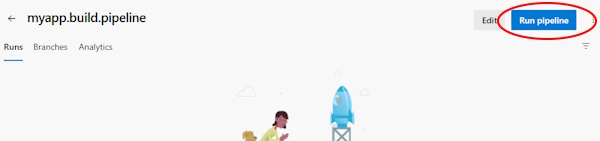

# Create Azure DevOps Pipelines

To create an Azure DevOps pipeline from an existing YML file in a GitHub or Azure Git repository, follow these steps.

---

**Step 1:** Click New pipeline from the Pipeline section of the Azure DevOps project

**Step 2:** Select source location as GitHub or your Azure Repos Git:

**Step 3:** Select the GitHub repository or your Azure Git repository

**Step 4:** Select Existing Pipelines YAML file

**Step 5:** Select the desired pipeline

**Step 6:** For most cases, when the pipeline source is shown, you can just click Run and start your pipeline.  However, you may want to fix the name as it defaults to the name of your repository, so select More Actions and Save the file.

**Step 7:** Click the three dots "More" button and select Rename/Move.

**Step 8:** Give your pipeline a more intuitive name.

**Step 9:** You should be ready to run your pipeline!

