# Getting started - Rock / Paper / Visual Studio

Welcome to GitHub Copilot! In this example, we'll show you how to use Copilot to write a simple .NET game.

## Prerequisites

Make sure that you meet the following requirements.

- [Visual Studio IDE](https://visualstudio.microsoft.com/downloads/) for Windows
- *[Copilot Extension for Visual Studio IDE](https://marketplace.visualstudio.com/items?itemName=GitHub.copilot). 

[See this documentation on how to install Copilot extension for Visual Studio IDE](../CopilotExtensionVS)

*Note: Starting with Visual Studio 17.10, GitHub Copilot is included in Visual Studio IDE. You can enable it by going to **Tools** > **Options** > **GitHub Copilot**.

## Steps

Please follow this step-by-step guide to get started with Copilot in Visual Studio IDE.

### Step 1: Launch Visual Studio IDE

Make sure that you followed all prerequisites and installed Visual Studio IDE and Copilot extension for Visual Studio IDE.

Search for **Visual Studio** after clicking Windows button.

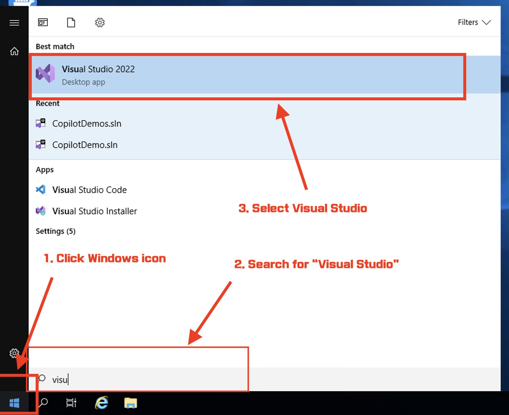

Then, your Visual Studio IDE will be launching.


### Step 2: Create a new project

Once Visual Studio IDE is launched, you will see the following screen. Although you can use an existig project, let's try to create a new project by selecting **Create a new project**.

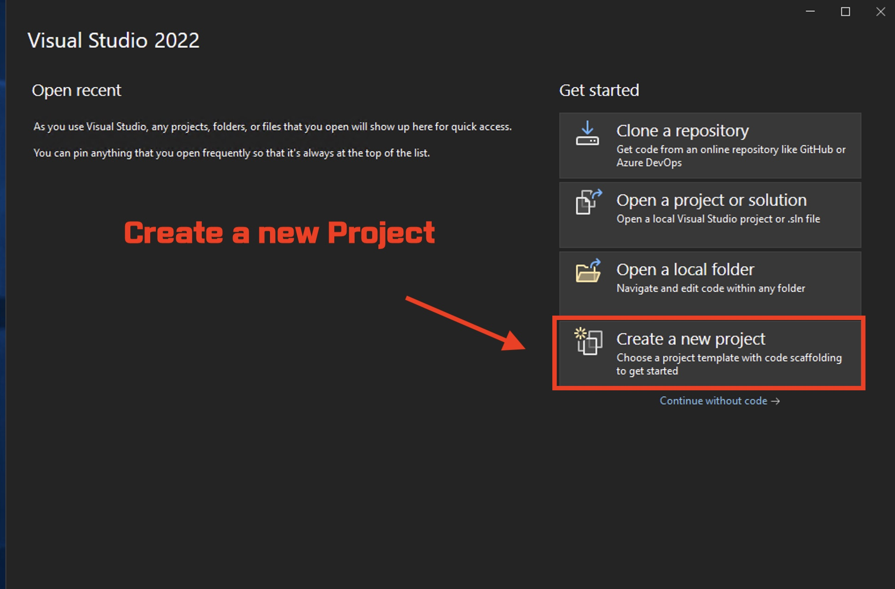

Then, you will see different options. Select **Console App (.NET Framework)** and click **Next**.

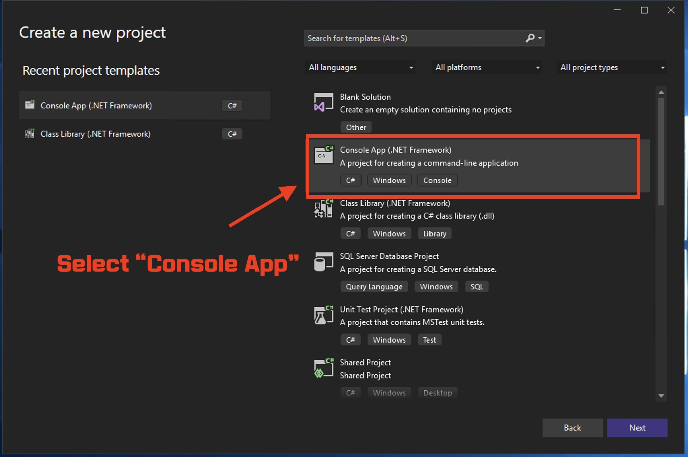

Then, you will see the following screen. Enter **HelloCopilot** as the project name and click **Create**.

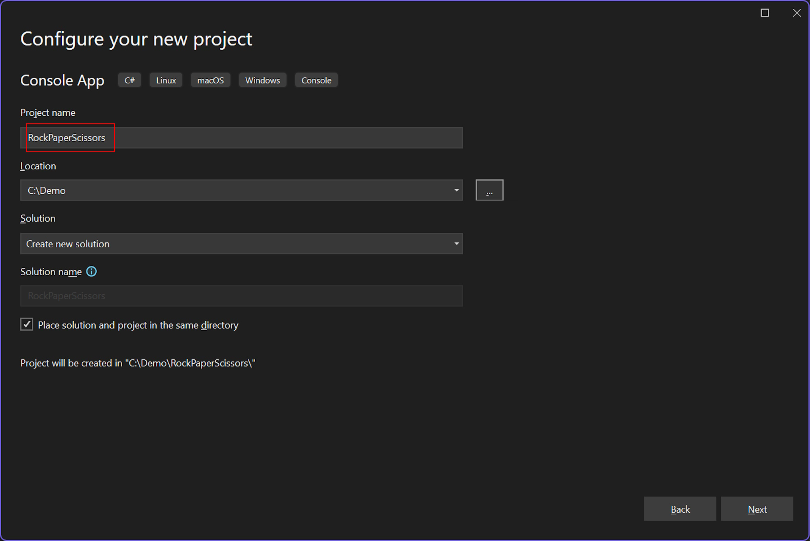

You will see a progress bar while Visual Studio IDE is creating a new project.

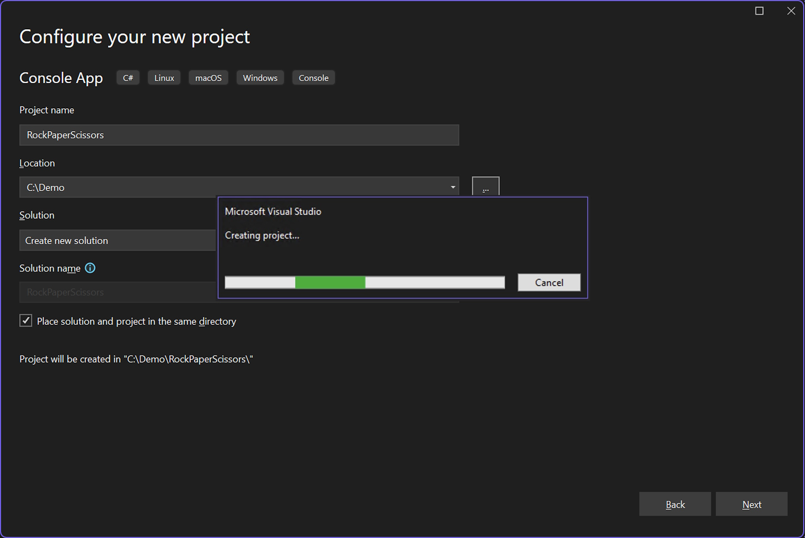

### Step 3: Check Copilot is enabled

Let's make sure that Copilot is enabled. On bottom, you should see **Auth Status: OK** under **Output** window. Make sure to select **GitHub Copilot** from the dropdown.


And you should also see a Copilot icon above the **Output** window.

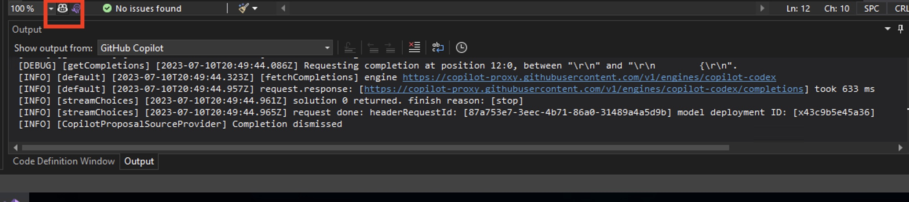

### Step 4: Create a new class named `RockPaperScissors`

Creating a new class named `RockPaperScissors.cs` by right clicking on the project:

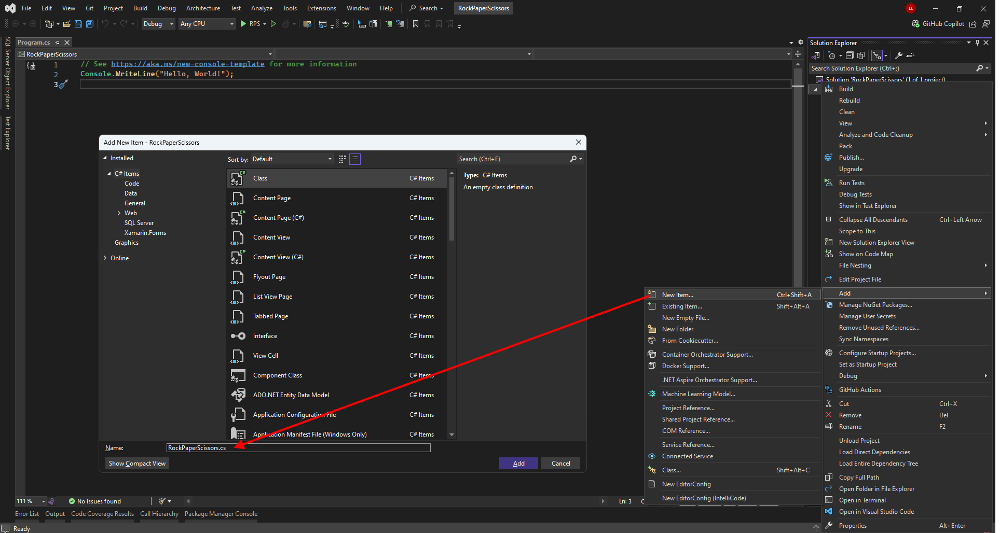

### Step 5: Add in comments

Add in comments to describe what the class does. This will create context copilot will use to generate code suggestions. The comments should look like this:

```c#
// create a rock paper scissors game
// 1. ask user to input rock paper or scissors
// 2. have the computer select a random choice
// 3. compare the two choices and send out the results
// 4. ask the user if they want to play again
```

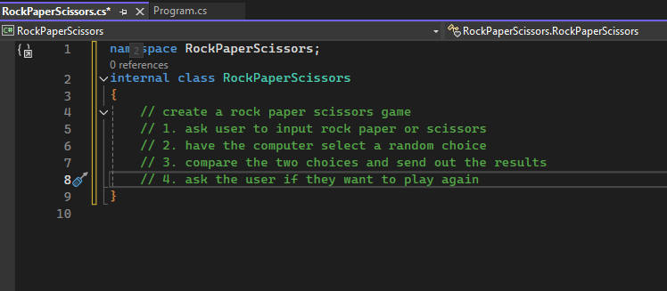

### Step 6: Ask user for input

Write out the step 1 comment into the class and press enter. GitHub Copilot should start suggesting code which you can decide to reject or accept.

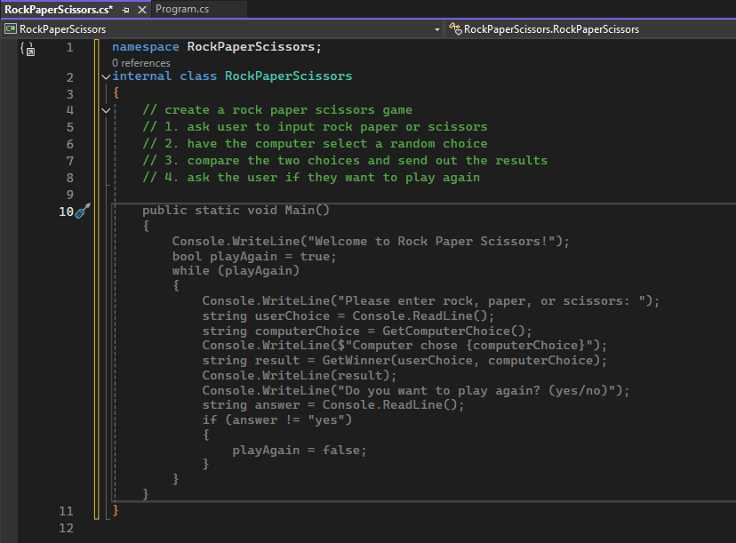

**_Shortcut Tip:_** If GH Copilot has not started suggesting code you can trigger it by pressing:

- `Option (⌥)+ \` for mac
- `Alt + \` for windows
- `Alt + \` for linux

### Step 7: Fixing some issues in the code

Once you've accepted the suggestion, you might see that it has generated code that contains some errors, as indicated by the red unlerlines. We can use GitHub Copilot to help fix these errors!

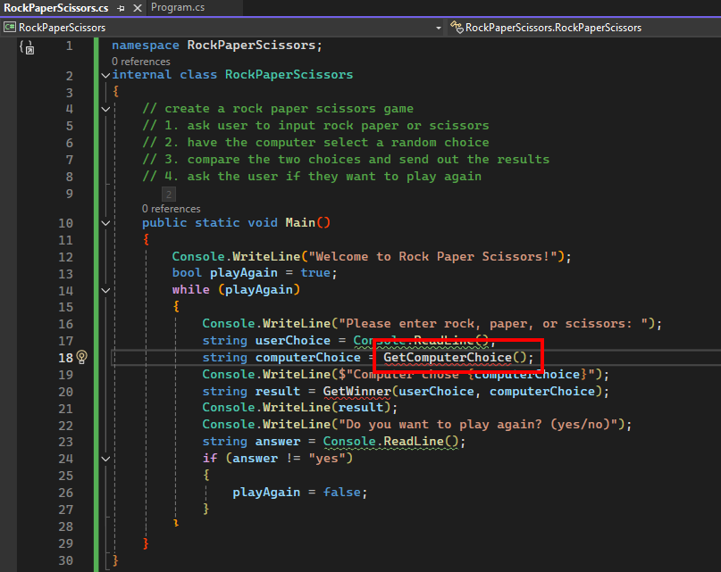

Place your cursor in the line with the error and press `Alt + /` to pop up GitHub Copilot Chat. You can then ask GitHub Copilot to help you fix the error.

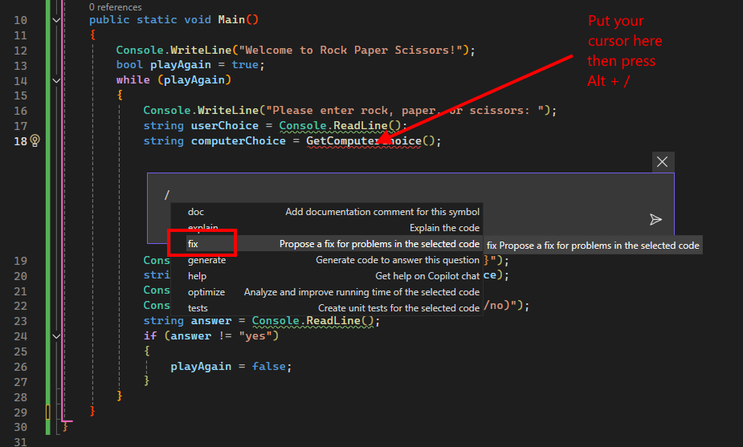

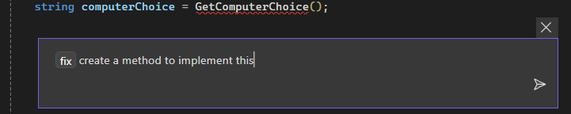

Visual Studio will pop up a code comparison tool so you can see what your suggestions look like:

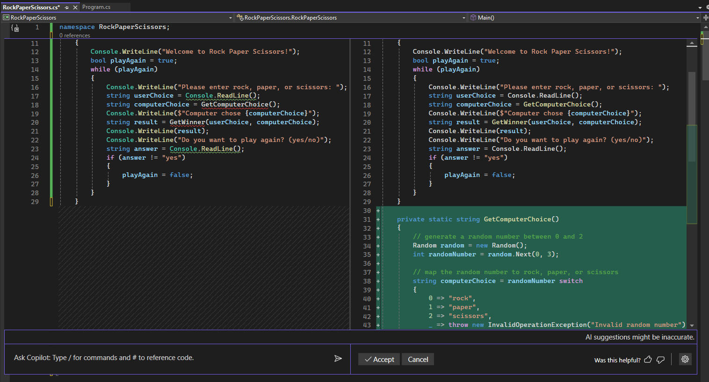

If you scroll down, you should see it generated two methods:

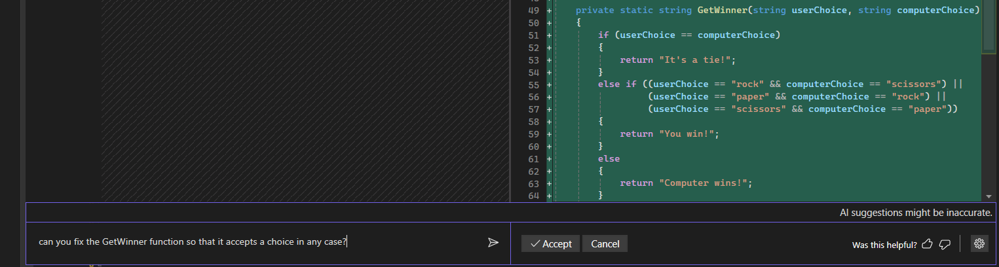

### Step 8: Refining the suggestions

You can interact with GitHub Copilot before accepting the code it suggests. In this case, I'm not a fan of how it repeats the lowercase() function each time it asks for user input. I'd rather keep this DRY (i.e. Do Not Repeat Yourself!) and move that into the function. Let's ask it to do better!

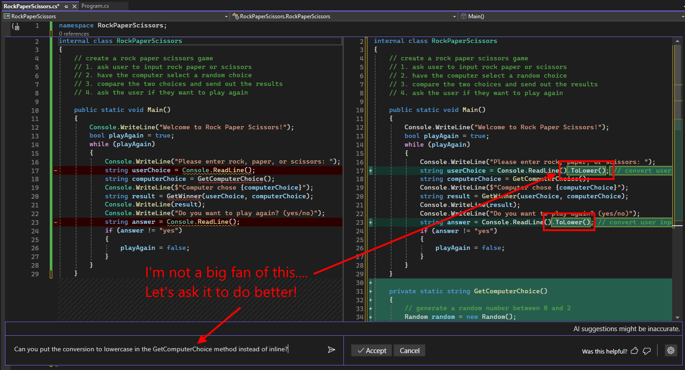

Now that the suggestion looks good, let's accept it!


### Step 9: Running the program

Your program should build successfully now.  However, since we added this method in it's own class, we need to make sure we call it from our main method.  Let's ask GitHub Copilot to help us with that!  

Note that I've used the "#" directive to tell Copilot WHERE to add to code into.

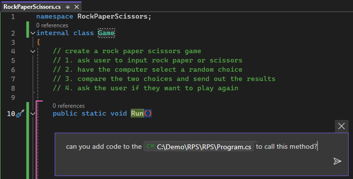

You can see that Copilot has added a method call to this file, but it's not quite right and is throwing an error.  Let's ask Copilot to explain why it doesn't work.
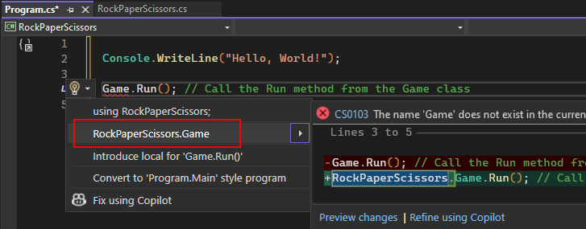

 I need to add the namespace in front of the method call - not sure why Copilot didn't do that.
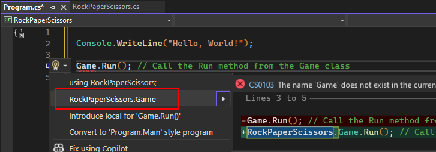

Yea!  Now it should build!  Your final result when you run the code again might look something like this.
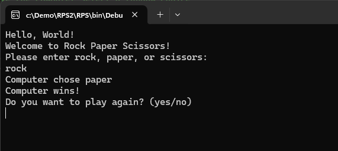

That is it! Congratulation on finishing your first exercise with Copilot. You can try to write more complicated code and see how Copilot can help you.

In the next lab, we'll refine this example and make it better, including user validation and some test cases.
