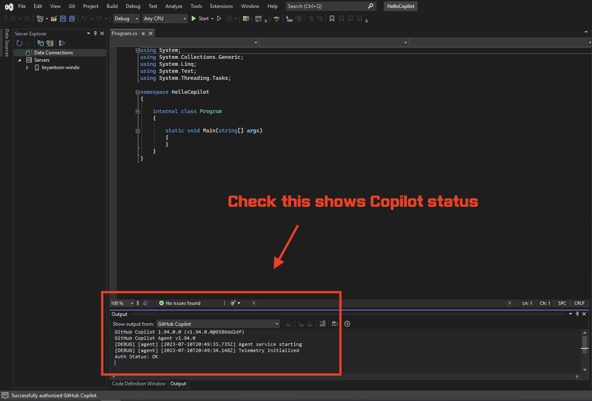
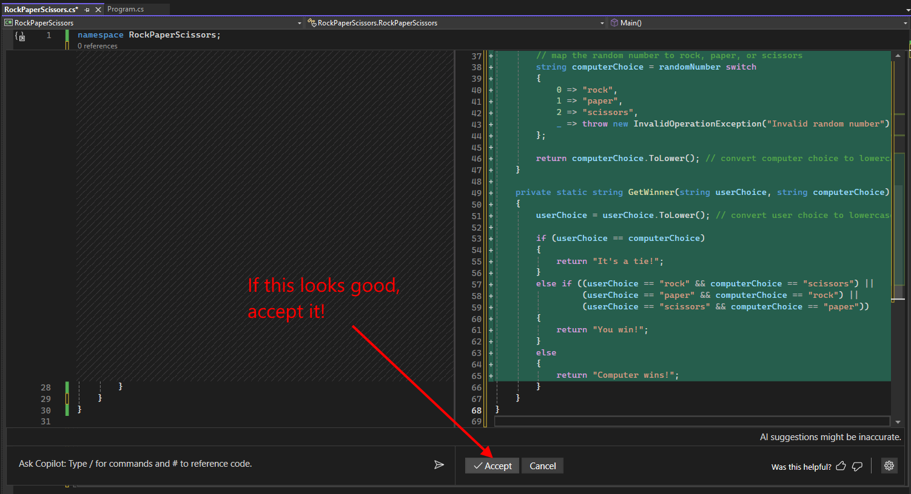

# Lab 1: Getting started - Rock / Paper / Visual Studio

Welcome to GitHub Copilot Labs! In this example, we'll show you how to use Copilot to write a simple .NET game.

## Prerequisites

Make sure that you meet the following requirements.

- [Visual Studio IDE](https://visualstudio.microsoft.com/downloads/) for Windows

- Access to GitHub Copilot
  - If you don't already have access to GitHub Copilot, you can set up a [free trial](https://github.com/github-copilot/signup?ref_cta=Copilot+trial&ref_loc=quickstart+for+github+copilot&ref_page=docs) or subscription for GitHub Copilot Individual on your personal GitHub account. For more information, see ["About GitHub Copilot Individual."](https://docs.github.com/en/copilot/copilot-individual/about-github-copilot-individual)

- Copilot Enabled in Visual Studio
  
  - **Note:** Starting with Visual Studio 17.10, GitHub Copilot is now included in Visual Studio IDE and you do not need to install an extension. You can enable it by going to **Tools** > **Options** > **GitHub Copilot**.

  - For versions prior to 17.10, see [this documentation](../../Docs/CopilotExtensionVS.md) to install the Copilot extension for Visual Studio IDE.

## Steps

Please follow this step-by-step guide to get started with Copilot in Visual Studio IDE.

### Step 1: Launch Visual Studio IDE

Make sure that you followed all prerequisites and installed Visual Studio IDE and Copilot extension for Visual Studio IDE.

Search for **Visual Studio** after clicking Windows button.


Then, your Visual Studio IDE will be launching.


### Step 2: Create a new project

Once Visual Studio IDE is launched, you will see the following screen. Although you can use an existig project, let's try to create a new project by selecting **Create a new project**.


Then, you will see different options. Select **Console App (.NET Framework)** and click **Next**.


Then, you will see the following screen. Enter **RockPaperScissors** as the project name and click **Create**.


### Step 3: Check Copilot is enabled

Once the project has been created and is loaded, let's make sure that Copilot is enabled. In the Output window, select **GitHub Copilot** from the dropdown and you should see **Auth Status: OK** under **Output** window. Make sure to .



And you *should* also see a Copilot icon above the **Output** window.  (On some systems, this icon does not show up and Copilot still works...)


### Step 4: Create a new class named `RockPaperScissors`

Creating a new class named `RockPaperScissors.cs` by right clicking on the project and selecting the "New Item..." option.


### Step 5: Talk to Copilot using comments

Let's start by adding in some comments to describe what the class should do. This will create context Copilot will use to generate code suggestions. The comments should look like this:

```c#
// create a rock paper scissors game
// 1. ask user to input rock paper or scissors
// 2. have the computer select a random choice
// 3. compare the two choices and send out the results
// 4. ask the user if they want to play again
```


### Step 6: Ask user for input

After you have entered the comments in step 1 into the class then press enter. GitHub Copilot should then start suggesting code which you can decide to reject or accept.


**_Shortcut Tip:_** If Copilot has not started suggesting code you can trigger it by pressing:

- `Option (⌥)+ \` for mac
- `Alt + \` for windows
- `Alt + \` for linux

If Copilot is still not responding, press enter again, or you can nudge it along by starting to type the first part of the code you want to generate, like "public" and then pausing for a moment to let it analyze what you are starting and it should generate some suggestions.

### Step 7: Fixing some issues in the code

Once you've accepted the suggestion, you might see that it has generated code that contains some errors, as indicated by the red underlines. Don't worry - we can use GitHub Copilot to help fix these errors!


Place your cursor in the line with the error and press `Alt + /` to pop up GitHub Copilot Chat. You can then ask GitHub Copilot to help you fix the error.


Visual Studio will pop up a code comparison tool so you can see what your suggestions look like:


If you scroll down, you should see it generated two methods:


### Step 8: Refining the suggestions

You can interact with GitHub Copilot before accepting the code it suggests. In this case, I'm not a fan of how it repeats the lowercase() function each time it asks for user input. I'd rather keep this DRY (i.e. Do Not Repeat Yourself!) and move that into the function. Let's ask it to do better!

``` yaml
Can you add a conversion to lowercase in the GetComputerChoice method?
```


Now that the suggestion looks good, let's accept it!



### Step 9: Running the program

Your program should build successfully now.  However, since we added this method in it's own class, we need to make sure we call it from our main method.

#### Rename Things

Before we ask GitHub Copilot to help us with that, let's rename the class from "RockPaperScissors" to "Game" (line 2 below) to make it more descriptive, and change the main function name from "Main" to "Run" (line 10 below). The best way to do that is to put your cursor in the name of the thing you are renaming and press "F2" - that way Visual Studio will automatically refactor and rename all places where this method or variable is used.

#### Call the Methods on Startup

Now let's ask Copilot to help us call this program! Put your cursor on the "Run" method name and press Alt+/ to launch Copilot.

**Note:** I've used the "#" directive to tell Copilot WHERE to add to code into. If you just copy/paste this line into chat, it won't pick up on that directive. You will have to type the "#" symbol yourself and then you should get a prompt for which file to use.

``` yaml
Can you add code to the #program.cs to call this method?
```


You can see that Copilot has added a simple method call to this file, but it's not quite right and is throwing an error.  Visual Studio can easily fix that for you by simply putting your cursor on the error and press Control+".". You will get a menu with possible fixes - pick the second option to add the namespace "RockPaperScissors" in from of the class name and that should fix it.


If you still get an error in calling the Run() method, you may need to make sure that the Run() method in the RockPaperScissors.cs file is defined as public (or internal).

Yea!  Now it should build!  Press F5 to run your program and it should look something like this:


That is it! Congratulations on finishing your first exercise with Copilot. You can try to write more complicated code and see how Copilot can help you.

In the [next lab](../RPS-Lab-2/README.md), we'll refine this example and make it better, then in future labs we'll add user validation and some test cases and more.
