# Lab 2: Adding Functionality - Rock / Paper / Visual Studio

Welcome to GitHub Copilot Labs! In this example, we'll add some additional functionality to the program created in Lab 1.

## Prerequisites

Make sure that you have completed the [initial lab](../RPS-Lab-1/README.md)

## Steps

Please follow this step-by-step guide to start adding functionality to your program.

---

### Step 1: Add a score keeping mechanism

Open the `RockPaperScissors.cs` class, then open GitHub Copilot Chat.  Ask Copilot to help you add a score keeping mechanism to the game by referencing the `RockPaperScissors.cs` class using the `#` directive.

``` yaml
can you add a separate method to #file:'RockPaperScissors.cs' to keep score and display the score at the end of each round?
```

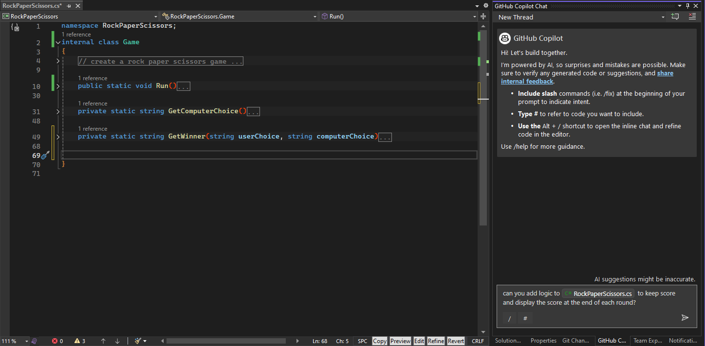

Click on the `Preview` (1) button to review the suggestion, which is good --- but it could be better!  Click on one of the alternative suggestions (2) (or type it in yourself it you don't get that suggestion), asking it to create a separate method for the score keeping mechanism.
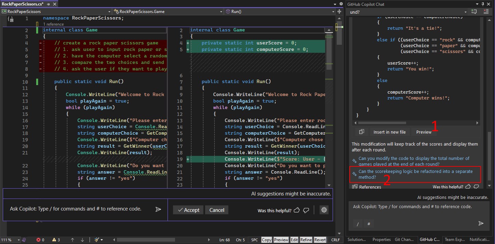

Be careful before you merge code into your base!  Sometimes the generated code has placeholders that say things like *"... existing code ..."*.  If you just blindly accept the changes, you may wipe out half of your program!  In this case, we will copy and paste the generated code.
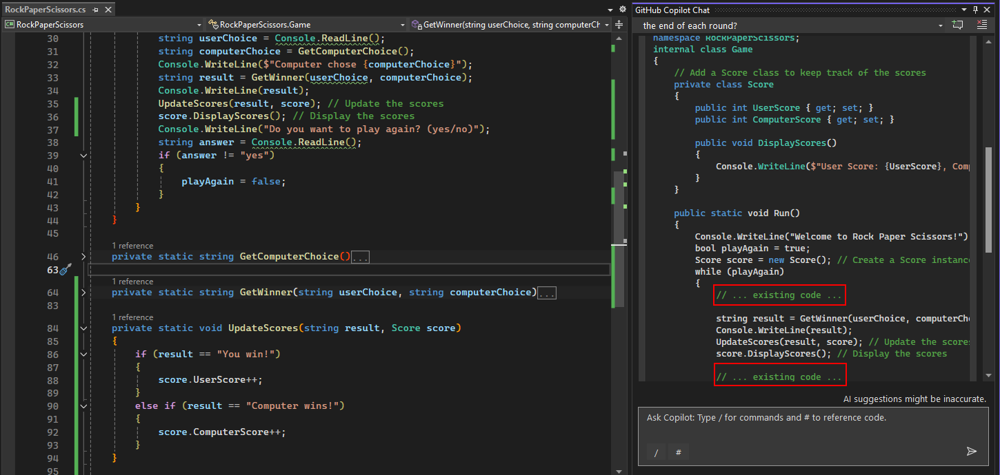

Copy and paste the lines to instantiate the class and update and display the scores in your main `Run` method, then add the new `Score` class and the new `UpdateScore` method into your file.  You should end up with something that looks like this:


---

### Step 2: Validate the User Input

Let's make it easier to get user input by asking Copilot to create a method to get the user input and then validate it.


Use this prompt:

``` yaml
Can you change this code so that the user choice is entered in a method called GetUserChoice?
```

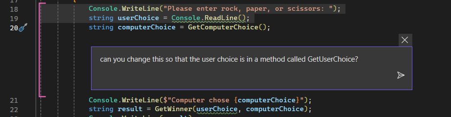

After examining the suggestion, this doesn't quite do what we'd like.  Click Cancel and let's try again.  

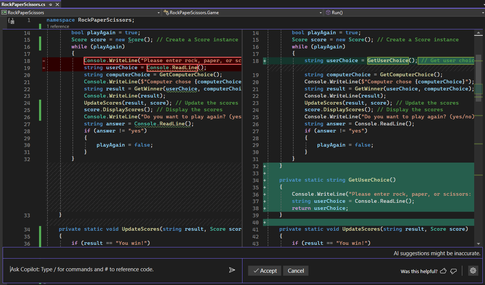

We can accept this suggestion, but then let's try to refine it a bit by being much more specific about what we want in our prompt:

``` yaml
Please change this method to validate the choices.  
Allow the user to enter data in upper or lower case.  
Allow the user to enter only the first character of the word, or the entire word.
Return an empty string if the input is not valid
```

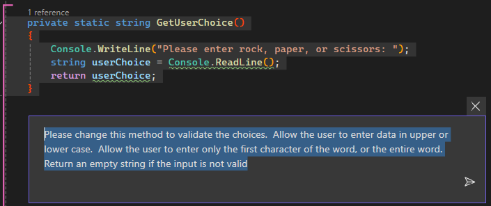

Much better!  Let's accept this as a good starting point!
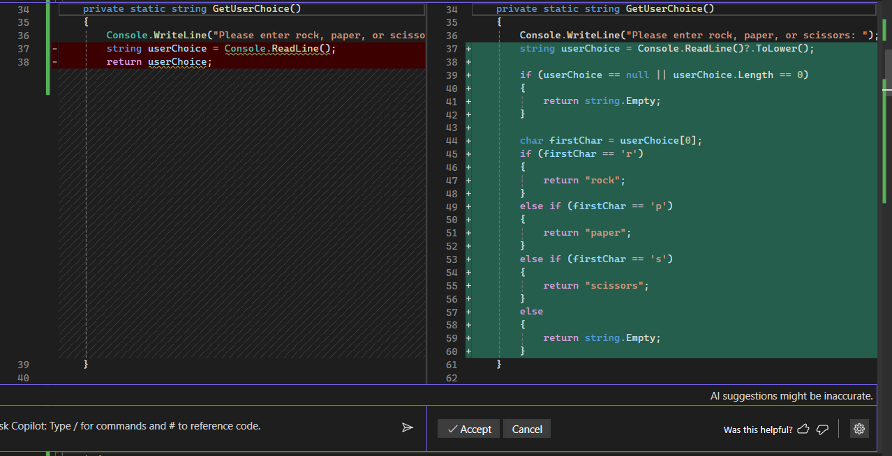

After you have accepted and created a GetUserChoice method, if you put your cursor on line 18 after the GetUserChoice() method call and hit enter, Copilot should automatically suggest some code to validate the user input.  You should accept this suggestion by pressing Tab so that invalid user input does not keep following the rest of the logic with a bad choice.

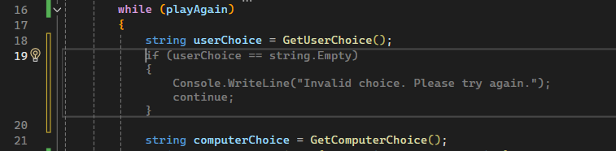

---

### Step 3: Validate Play Again Logic

Let's also move the Play Again logic into it's own function and validate that input better by giving some suggestions as to what validation you want to happen:

``` yaml
Please replace these lines with a method call which returns a boolean.
The method value should be assigned to the playAgain variable.  
In the method, the user should be able to enter data in either upper or lower case.
The method should return false if the first letter is not a Y.
```

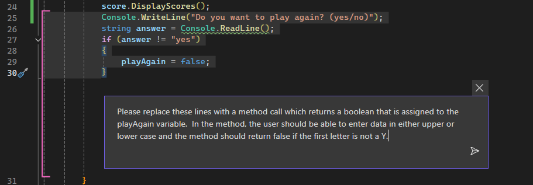

In this case, the over eager Copilot created the code but put it in the wrong spot. However if you just move the new method to be down below the current method, it should work just fine.

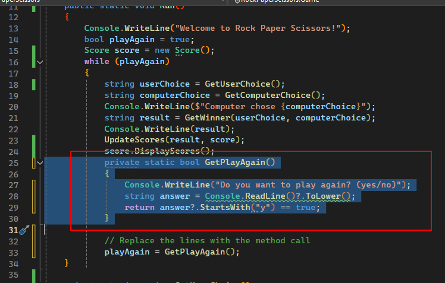

Here is what it looks like once it's been moved:

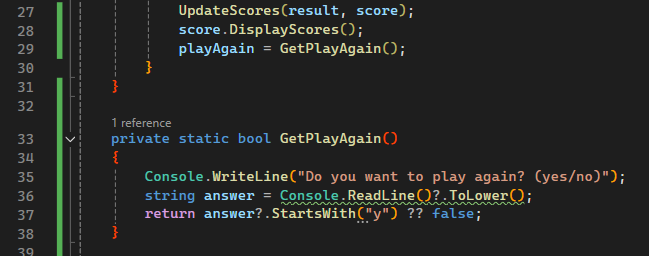

Press F5 to run and test out your new game!

---

### Lab Complete: Input is Validated!

Congratulations on finishing your second exercise with Copilot!  Your program should now be a bit more robust and accept only valid input from the user. In the [next lab](../RPS-Lab-3/README.md), we'll work on making the user interface a bit nicer.
