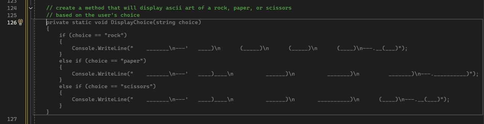
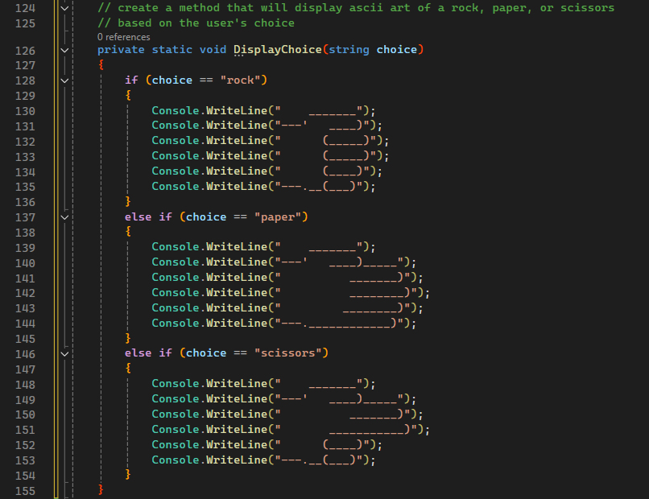
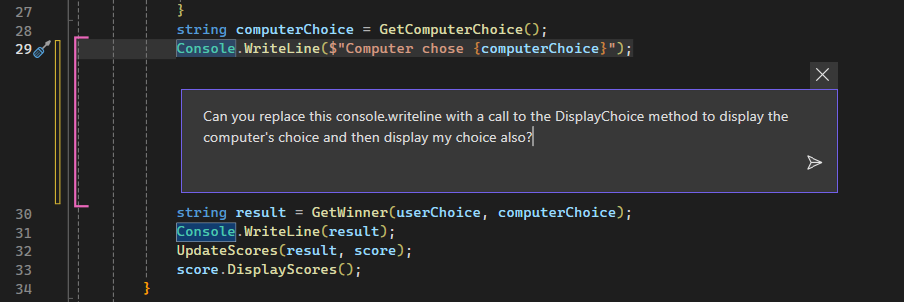
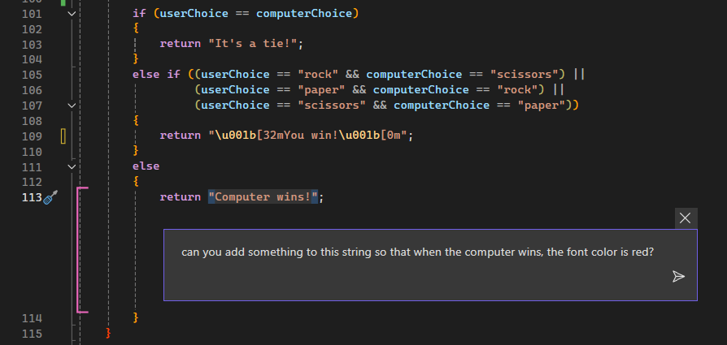
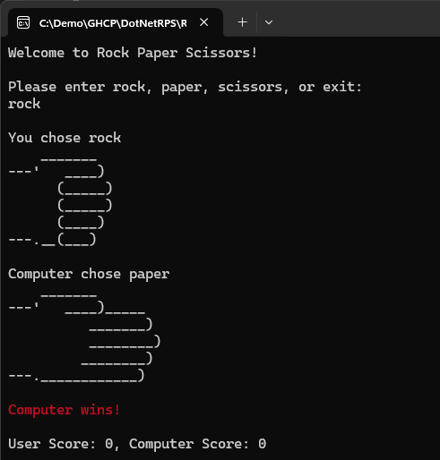

# Lab 3: Adding Beauty (optional) - Rock / Paper / Visual Studio

Welcome to GitHub Copilot Labs! In this example, we'll make our program we created in Lab 2 a little more interesting.

## Prerequisites

Make sure that you have completed the [Lab 2](../RPS-Lab-2/README.md)

## Steps

Please follow this step-by-step guide to start adding functionality to your program.

---

### Step 1: Create a method to display ASCII art

Let's go back and use the comment method of prompting Copilot to create a method to display ASCII art for the Rock, Paper, and Scissors.  This will make our game a little more interesting.

Let's activate Copilot by adding a comment in your code and hitting enter:

``` yaml
// create a method that will display ascii art of a rock, paper, or scissors
```



You may get some code that doesn't *look* right because it is all on one line.  You can ask Copilot to reformat the ASCII art by breaking it up into multiple lines.  Give it a couple of different suggestions to see if you can get it to format correctly, like this:

``` yaml
can you break down this code so that each line of ascii art is written on it's own line with it's own console.writeline?
```

You can continue to coax it along by asking it to refine the code if it's not what you want:

``` yaml
that's almost right, but the rock is still on only two lines. 
can you break that up to have six lines like the others?
```

Once you're done, it should look something like this



---

### Step 2: Get your program to display the choices in ASCII art

Now that we have an image generator, let's use it to display the choices for the user and the computer.  We'll need to call this method from the `DisplayChoice` method.  Let's ask Copilot to do that for us:

``` yaml
Can you replace this console.writeline with a call to the DisplayChoice method to display the computer's choice and display my choice also?
```



Press F5 to run and test out your new game and it should show your choices graphically!

### Step 3: One more thing...

Let's make the game a little more interesting by adding some color to the output.  You may not know how to specify the Console.ForegroundColor inside a string, but I bet Copilot does!  Highlight each of the strings in the GetWinner() method and ask Copilot to add some color to the output based on the result of the game, like these three prompts:

``` yaml
can you add something to this string so that when the user wins, the font color is green?
can you add something to this string so that when the computer wins, the font color is red?
can you add something to this string so that when it's a tie, the font color is blue?
```



Now press F5 to run and test out your new beautiful game!



---

### Lab Complete: Your game looks awesome!

Congratulations on finishing your third exercise with Copilot!  Your program should now be a bit more visually interesting. In the [next lab](../RPS-Lab-4/README.md), we'll refactor it a bit to make the code better.
