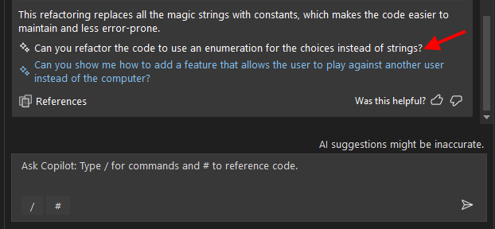

# Lab 4: Refactoring - Rock / Paper / Visual Studio

Welcome to GitHub Copilot Labs! In this example, we'll refactor our code to make it more maintainable and more testable.

## Prerequisites

Make sure that you have completed the [Lab 3](../RPS-Lab-3/README.md)

## Steps

Please follow this step-by-step guide to start adding functionality to your program.

---

### Step 1: Basic Refactoring Suggestions

Let's start out by asking Copilot if it has any suggestions for us:

``` c#
can you suggest some ways that we can refactor #file:'RockPaperScissors.cs'  to make it more maintainable?
```


That suggestion is pretty broad, but it came back with a LOT of things that we could improve on, but probably too many.

---

### Step 2: Refactor the GetUserChoice method

Let's tackle them one by one, starting with simplifying the GetUserChoice method.  Ask Copilot to help you with that:

``` c#
Can you break the GetUserChoice method up into more maintainable methods?
```

Copilot will suggest a few methods that you can extract from the GetUserChoice method.  Here's what it suggested for me:


Insert these two methods, then change the line that calls GetUserChoice() to call these two methods instead.

Once you have those methods and calls, you can delete the GetUserChoice() method and try running the program.

---

### Step 3: Removing Magic Strings

Next, let's ask Copilot to help us remove the magic strings from the code.  Ask Copilot to help you with that:

``` c#
Can you refactor this file so that it doesn't use magic strings?
```

Note: if you see only a PARTIAL code fragment with places that say "//rest of the code ..." and much of your code is missing, you can ask Copilot to stop doing that and give you the full code instead:

``` c#
can you update this example with ALL of the code, not comments saying "// rest of the code"?  
I want to be able to replace the entire class with these suggestions.
Keep my comments in the code also and don't remove them.
```


Now click on Preview and look at the changes that were suggested.  You should see that Copilot has replaced all of the magic strings with constants.  Accept the changes and then run it to make sure it still works.

---

### Step 4: Accepting Other Suggestions

If you notice, Copilot completed the previous refactoring of our code, then provided suggestions for other improvements.  You can accept these suggestions by clicking on the provided link.



Maybe up to this point, enumerations were a new concept and you were sure how you could use them. Copilot has suggested that and given you a good example of how to use them.  You can accept this suggestion by clicking on the Preview and then accepting the changes.


---

### Step 5: Refactoring Files

If you notice, Copilot completed the previous refactoring of our code, then provided suggestions for other improvements.  You can accept these suggestions by clicking on the provided link.

``` c#
can you refactor this solution so that the class "Score" is in it's own separate file?
```

Click on the "Insert into new file" option


Then save the file:


You can now safely delete the "private class Score" section from the RockPaperScissors.cs file.

Run the program to make sure it still works and you should have a refactored version of the Rock Paper Scissors game!

---

### Step 6: Adding documentation to methods

Method documentation is very useful when you can calling methods or APIs from other methods.  Use the inline Copilot Chat to select a method that has parameters and needs a documentation header (like the ValidateAndConvertInput() method) and then ask Copilot to help you with that:

``` c#
Can you add a documentation header to this method?
```


You can repeat this for each of the methods in your code and end up with a fully documented program.  Try selecting multiple methods at once and asking Copilot to add documentation to all of them at once!

---

### Step 7: Create system documentation

Before we finish, let's ask Copilot to help us create a system level README file that explains what our program does and what each of the files is used for.  This will help anyone who comes along later to understand what we did.

First, create a README.md file in the root of your project.  


Open the file, then ask Copilot to help you generate some documentation for it, and copy and paste the resulting documentation into your README.md file:

``` c#
can you examine this solution and create a readme document that explains what this program does, and what each of the files is used for?
```


Sweet! Documentation complete!


---

### Lab Complete: Your code looks much better now!

Congratulations on finishing your fourth exercise with Copilot!  Your program should now be a bit cleaner now, (although I'm sure there is more technical debt left for future training exercises!). In the [next lab](../RPS-Lab-5/README.md), we'll add some test cases to make the code even more robust.
