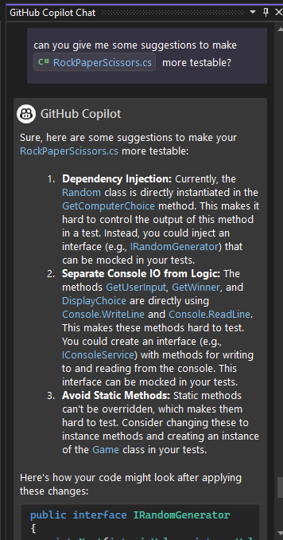

# Lab 5: Unit Testing - Rock / Paper / Visual Studio

Welcome to GitHub Copilot Labs! In this example, we'll add some unit tests to our project.

## Prerequisites

Make sure that you have completed the [Lab 4](../RPS-Lab-4/README.md)

## Steps

Please follow this step-by-step guide to start adding functionality to your program.

---

### Step 1: Adding Unit Tests

Up until now, we've behaved like normal developers - we created a working program, then made it look pretty, then delegated our "create some documentation" to someone else - Copilot!  

Now we're going to try and delegate another task to Copilot that most developers tend to put off - we're going to add some unit tests.

First, let's add a test project to our solution.  Right-click on the solution and select "Add" -> "New Project...", use the MS Test project template and giving it a name of RockPaperScissors.Tests.


Once you create the project, it should open the default UnitTest1.cs file.  Add a simple Console.WriteLine("Hello World!"); statement to the TestMethod1 method to test it out and make sure you can actually run the unit tests.  Once you've validated that with a successful run, you can delete the default test method and we'll start building out some real tests.  

Note: You will have to build your project before you can open the Test Explorer window and run the tests. 

Once you get it to run, you should see all green check marks in the Test Explorer window.


---

### Step 2: Setup - Link your projects and Rename

In order to get tests working with your main project, you need to add a reference to your main project in your test project.  Right-click on the test project Dependencies and select "Add Project Reference...".  In the Reference Manager window, check the box next to your main project, then click "OK".


Rename the file from UnitTest1.cs to RockPaperScissorsTests.cs.  When you do that, Visual Studio should prompt you to rename the class as well.  Accept the prompt and rename the class to RockPaperScissorsTests.


---

### Step 3: Create one test that crosses projects

Now, let's add our first test that calls validate input method.  Ask Copilot to create one test that call the ValidateAndConvertInput() method in the RockPaperScissors class using the #File directive.

``` bash
can you add a test here to call the ValidateAndConvertInput() method in the #file:'RockPaperScissors.cs' ?
```

Accept the proposed test method that Copilot generated.


When you look at the results, you should see that there are errors in your new test method - which isn't Copilot's fault!.  You can hover over the error and see the error message ("*inaccessible due to it's protection level*"), and if you click on the down arrow, you should see an option called "Fix using Copilot".


Click on that and Copilot give you some background on what happened and why: most of the classes and methods in our game are either internal or private. We need to make them method public in order to test it from another project.


Open the RockPaperScissors.cs file and change the class, enum, and methods from private to public.  You should see the error go away in your test file.


---

### Step 4: Create a test suite for the ValidateAndConvertInput method

Remove the first method you just created, and let's let Copilot create an entire set of tests that call the ValidateAndConvertInput() method in the RockPaperScissors class using the #File directive.

``` bash
can you create a series of tests that test the ValidateAndConvertInput method in the #file:'RockPaperScissors.cs' ?
```


Once you've accepted the proposed tests, click on the Run All Tests icon in the Test Explorer window, and you should see all of your tests pass.

---

### Step 5: Another way to generate tests

In the previous examples, we started in the test project and called back into a file to create a test for a single method. You can also start in the main project and ask Copilot to create a suite of tests for an entire file.  This is a good way to create tests for methods that you know you need to test, but you're not sure how to test them.

Open GitHub Copilot Chat and ask Copilot to create a test suite for the RockPaperScissors.cs file using the "/"+tests and "#"+<fileName> prompt.

``` bash
/tests #RockPaperScissors.cs
```


You can see that Copilot has created a series of tests for the entire file.  You can accept these tests by using the "Copy" icon and pasting them into your RockPaperScissorsTests.cs file, and then running them in the Test Explorer window.


---

### Step 6: Let's ask for some expert advice

We have some tests running and all is well. However, I get that nagging feeling that we could do better...  Let's ask Copilot for some advice on how to improve our tests.

``` bash
can you give me some suggestions to make #file:'RockPaperScissors.cs'  more testable? 
```



All of these are great suggestions, but we don't have time for that in this class.  Feel free to explore and learn more about interfaces and dependency injection by asking Copilot for more info and help on these topics.  But at this point, we've learned enough about creating tests for this lab!

---

### Lab Complete: Your code is now testable!

Congratulations on finishing your fifth exercise with Copilot!  Your program should now be ready for you to create more unit tests to ensure complete coverage. In the next lab (if it ever gets written...!), we'll use Copilot to create a pipeline that builds your program, runs the unit tests, and then shows your code coverage in the pipeline output.
