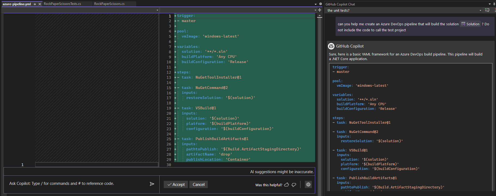
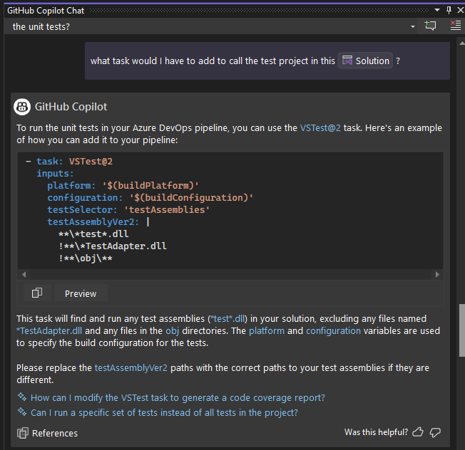
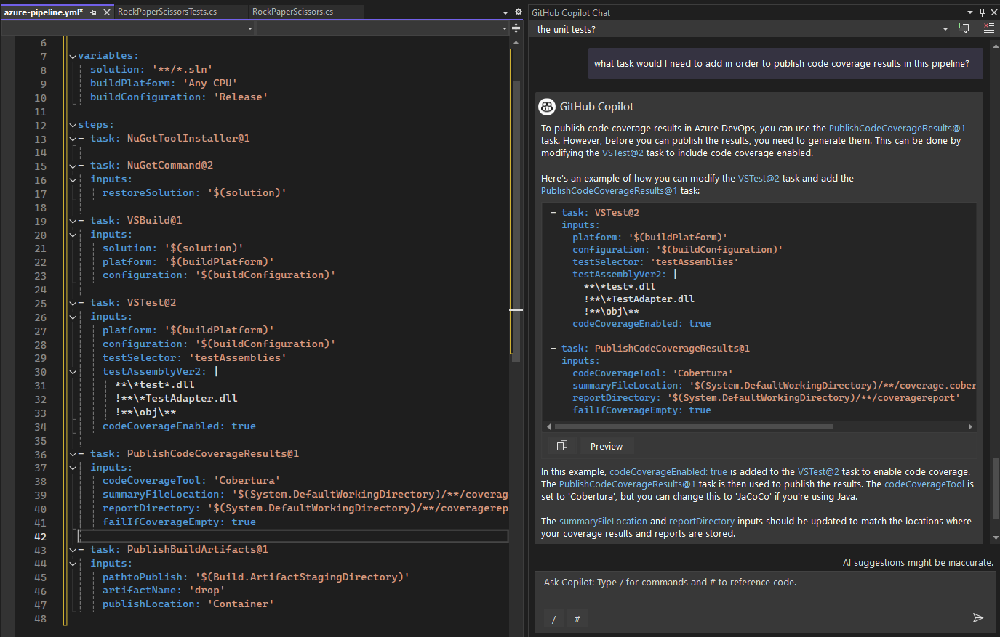
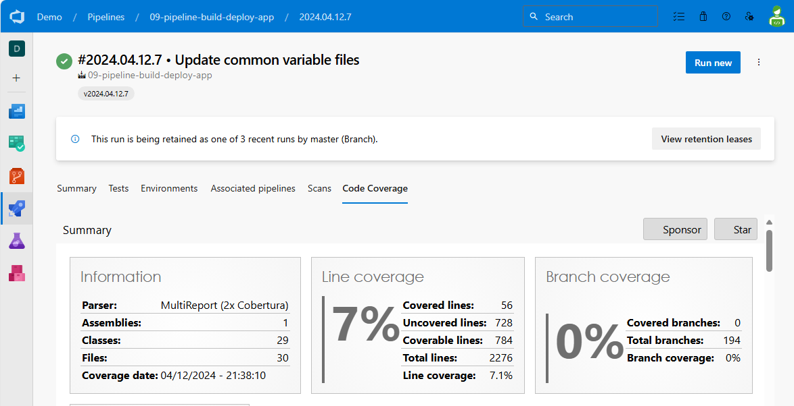
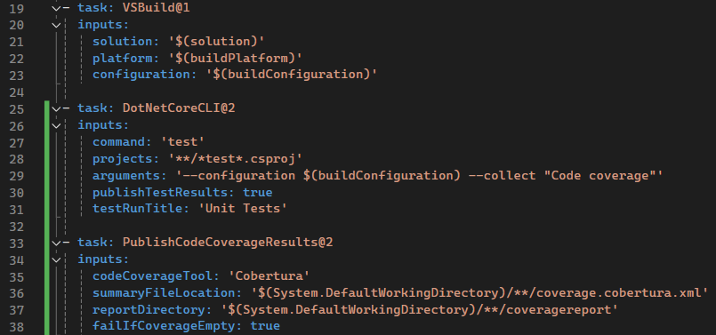

# Lab 6: Build and Test Pipeline - Rock / Paper / Visual Studio

Welcome to GitHub Copilot Labs! In this example, we'll create a build pipeline and also have it run your unit tests.

## Prerequisites

Make sure that you have completed the [Lab 5](../RPS-Lab-5/README.md)

## Steps

Please follow this step-by-step guide to start adding functionality to your program.

---

### Step 1: Create a Pipeline

Create a file named azure-pipeline.yml, then open Copilot Chat and ask Copilot to help you create an Azure DevOps pipeline that will build the solution.

``` bash
can you help me create an Azure DevOps pipeline that will build the solution #solution? Do not include the code to call the test project
```

Note: the decision to exclude the test project is intentional.  We do that to limit the amount of code that Copilot generates, so that this doesn't get blocked by the exclude public code policy.  We will add that later.



---

### Step 2: Add Task to Call Test Project

Use Copilot to create a task that will call the tests and then copy/paste that before the PublishBuildArtifact task.

``` bash
what task would I have to add to call the test project in this #solution ?
```



---

### Step 3: Add a Code Coverage Task

Finally, we can ask Copilot to add a task that will publish the code coverage results.

``` bash
what task would I need to add in order to publish code coverage results in this pipeline?
```



---

### Lab Complete: You have a build pipeline!

Congratulations on finishing this last exercise with Copilot!  Your program should now be ready to publish to Azure DevOps so you can create an automated build pipeline that will run your unit tests and show you a nice code coverage graph, like this!





---

We hope you have enjoyed these labs and learned a lot from them!
