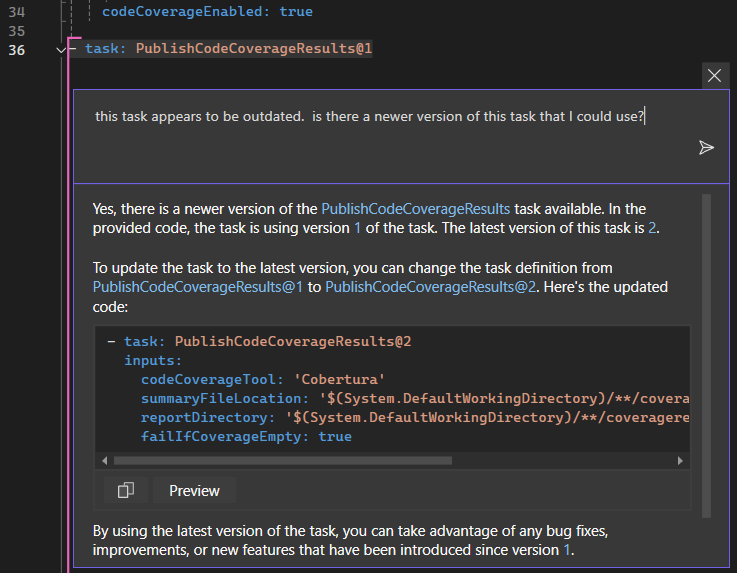

# Lab 6: Build and Test Pipeline - Rock / Paper / Visual Studio

Welcome to GitHub Copilot Labs! In this example, we'll create a build pipeline and also have it run your unit tests.

## Prerequisites

Make sure that you have completed [Lab 5](../RPS-Lab-5/README.md).

## Steps

Please follow this step-by-step guide to add additional functionality to your program. Remember that Copilot is non-deterministic so it may not always provide the same suggestions as shown here. You may have to adapt the prompts and lab directions to get the desired results for your particular program!

---

### Step 1: Create a Pipeline

Create a file named azure-pipeline.yml, then open Copilot Chat and ask Copilot to help you create an Azure DevOps pipeline that will build the solution.

``` yaml
can you help me create an Azure DevOps pipeline that will build the solution #solution? 
Do not include the code to call the test project
```

> Note: the decision to exclude the test project is intentional.  We do that to limit the amount of code that Copilot generates, so that this doesn't get blocked by the exclude public code policy.  We will add that step back in later.


---

### Step 2: Add Task to Call Test Project

Use Copilot to create a task that will call the tests and then copy/paste that before the PublishBuildArtifact task.

``` yaml
what task would I have to add to call the test project in this #solution ?
```


---

### Step 3: Add a Code Coverage Task

Finally, we can ask Copilot to add a task that will publish the code coverage results for our review:

``` yaml
what task would I need to add in order to publish code coverage results in this pipeline?
```


This is a good first take on this task, but as we'll see in the next step, it can be improved.

---

### Step 4: After the first build

If you were to go into Azure DevOps and set up this pipeline and run it for the first time, a few issues will pop up that need your attention.  One is that the "task: PublishCodeCoverageResults@1" is using outdated version, which is a common problem that Copilot can help you with.  Highlighting the task line and pop up Copilot Chat inline:

``` yaml
this task appears to be outdated.  
is there a newer version of this task that I could use?
```



Replace the task with suggested code and that task should be good to go.

However, one more thing that is not evident is that you will likely get an error from the PublishCodeCoverageResults task, because the Publish task is looking a file that doesn't exist. We'll need to change out the test runner with a DotNetCore version that will allow us to specify arguments to create output in the proper format file for the Cobertura Code Coverage Tool.  

You can ask Copilot to help you with that as well, although getting the right arguments for the DotNetCoreCLI task can be a bit tricky and take a lot of time refining the tasks and executing multiple pipeline runs to get them just right. To save some time in this lab, replace the VSTest task with the following two tasks that will run the tests, produce the output, and publish them in a was that Azure DevOps pipelines and Cobertuba will understand:

``` yaml
- task: DotNetCoreCLI@2
  displayName: 'Run Unit Tests'
  inputs:
    command: 'test'
    projects: '**/*test*.csproj'
    arguments: '--logger trx --results-directory "$(System.DefaultWorkingDirectory)/TestResults/Coverage/" --collect "XPlat Code Coverage"'
    publishTestResults: false
    testRunTitle: 'Unit Tests'

- task: PublishTestResults@2
  displayName: 'Publish Test Results'
  inputs:
    testResultsFormat: VSTest
    testResultsFiles: '**/*.trx'
    searchFolder: '$(Build.SourcesDirectory)/TestResults/Coverage/'
    testRunTitle: 'Unit Tests'
```

---

### Lab Complete: You have a build and test pipeline!

Congratulations on finishing this last exercise with Copilot!  Your program and pipeline should now be ready to publish to Azure DevOps so you can create an automated build pipeline that will run your unit tests and show you test results and a nice code coverage graph, like this!


---

We hope you have enjoyed these labs and learned a lot from them and you are now able to go out and create great things with Copilot!
