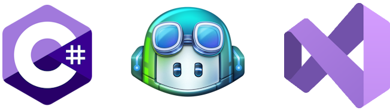

# GitHub Copilot Demos for C# using Visual Studio IDE

This repo contains a series of GitHub Copilot labs for **C#** and **.NET** using the **Visual Studio IDE.** This is going to be useful for customers who are interested in using Copilot for C# and .NET and want to use Copilot to generate code through the Visual Studio IDE.

Note that Copilot extension for Visual Studio IDE is **only available for Windows**. If you are using Mac, you can use Copilot through VS Code.

> GitHub Copilot is only available for VS Code, Visual Studio IDE for Microsoft Windows, NeoVim, and IntelliJ and GitHub Copilot is not available for Jupyter Notebooks.

## Prerequisites

All of demos here will require the following as minimum requirements. Some exercises might have more requirements. This assumes that you have a Windows environment.

- [Visual Studio IDE](https://visualstudio.microsoft.com/downloads/) for Windows

- Access to GitHub Copilot
  - If you don't already have access to GitHub Copilot, you can set up a [free trial](https://github.com/github-copilot/signup?ref_cta=Copilot+trial&ref_loc=quickstart+for+github+copilot&ref_page=docs) or subscription for GitHub Copilot Individual on your personal GitHub account. For more information, see ["About GitHub Copilot Individual."](https://docs.github.com/en/copilot/copilot-individual/about-github-copilot-individual)

- Copilot Enabled in Visual Studio
  
  - **Note:** Starting with Visual Studio 17.10, GitHub Copilot is now included in Visual Studio IDE and you do not need to install an extension. You can enable it by going to **Tools** > **Options** > **GitHub Copilot**.

  - For versions prior to 17.10, see [this documentation](./Docs/CopilotExtensionVS.md) to install the Copilot extension for Visual Studio IDE.

## Demos

Start with [Lab 1](./Labs/RPS-Lab-1/README.md) and then work your way up into the other ones.

1. [Lab 1](./Labs/RPS-Lab-1/README.md) - Create a simple working `RockPaperScissors` game.
1. [Lab 2](./Labs/RPS-Lab-2/README.md) - Add more functionality to the `RockPaperScissors` game.
1. [Lab 3](./Labs/RPS-Lab-3/README.md) - Make the game output more visually appealing.
1. [Lab 4](./Labs/RPS-Lab-4/README.md) - Refactor the game and add some documentation.
1. [Lab 5](./Labs/RPS-Lab-5/README.md) - Add some unit tests to the game.
1. [Lab 6](./Labs/RPS-Lab-6/README.md) - Create a build and test pipeline for the game.

As you progress through the labs, there are working source code solutions for you to look at if needed in the [Solutions](./Solutions/) folder.

## Contribution

If you want to contribute to this repo, please follow the [Contribution Guidelines](CONTRIBUTING.md).
