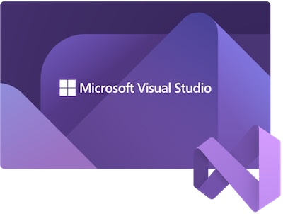

# GitHub Copilot Demos for C# using Visual Studio IDE

This contains a collection of demos for Copilot for **C#** and **.NET** through **Visual Studio IDE.** This is going to be useful for customers who are interested in using Copilot for C# and .NET and want to use Copilot to generate code through Visual Studio IDE.

Note that Copilot extension for Visual Studio IDE is **only available for Windows**. If you are using Mac, you can use Copilot through VS Code.

> GitHub Copilot is only available for VS Code, Visual Studio IDE for Microsoft Windows, NeoVim, and IntelliJ and GitHub Copilot is not available for Jupyter Notebooks.

## Prerequisites

All of demos here will require the following as minimum requirements. Some exercises might have more requirements. This assumes that you have a Windows environment.

- [Visual Studio IDE](https://visualstudio.microsoft.com/downloads/) for Windows
- *[Copilot Extension for Visual Studio IDE](https://marketplace.visualstudio.com/items?itemName=GitHub.copilot).

[See this documentation on how to install Copilot extension for Visual Studio IDE](./CopilotExtensionVS)

*Note: Starting with Visual Studio 17.10, GitHub Copilot is included in Visual Studio IDE. You can enable it by going to **Tools** > **Options** > **GitHub Copilot**, and do not need to install an extension.

## Demos

You want to start with the basic one then jump to other ones.

1. [Lab 1](./Labs/RPS-Lab-1/README.md) - Create a simple working `RockPaperScissors` game.
1. [Lab 2](./Labs/RPS-Lab-2/README.md) - Add more functionality to the `RockPaperScissors` game.
1. [Lab 3](./Labs/RPS-Lab-3/README.md) - Make the game output more visually appealing.
1. [Lab 4](./Labs/RPS-Lab-4/README.md) - Refactor the game and add some documentation.
1. [Lab 5](./Labs/RPS-Lab-5/README.md) - Add some unit tests to the game.

## Contribution

If you want to contribute to this repo, please follow the [Contribution Guidelines](CONTRIBUTING.md).
